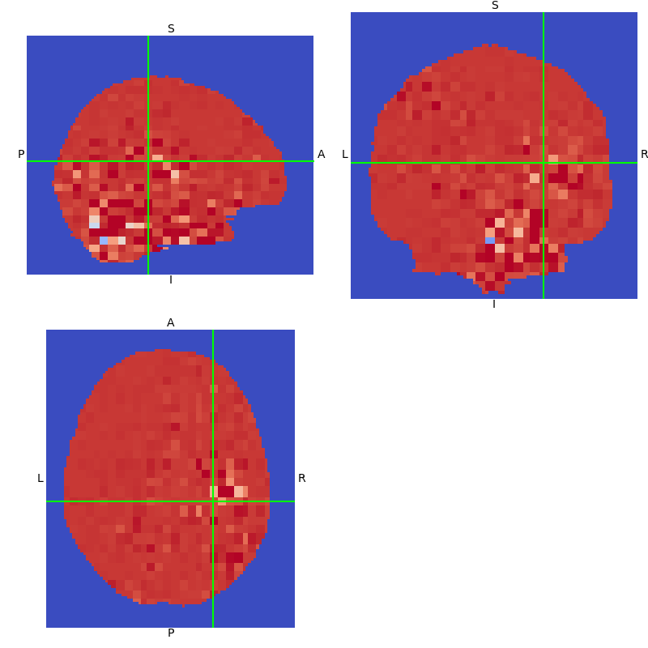

# Master Thesis -- Interpretable Medical Image Analysis

## Motivation

- New state-of-the-art (SOTA) prediction methods use neural networks (NNs)
    - NNs are black box – unclear why a prediction was made
- Current SOTA does not use recent methodological advances in NNs
    - I.e. mostly based on conventional fully convolutional architecture (VGG, ResNet, DarkNet)
    - More recent methods involving attention based methods not used
    - Transformer based methods, e.g. ViT, SWIN, DeepViT, etc. not used
- Advances in NN interpretability almost exclusively used in 2D naturalistic domain
    - some applications in fMRI – mostly “old-school” feature visualization techniques
    - even methods implemented in popular interpretability libraries (captum.ai) not used in medical imaging
    - new SOTA methods like Transformer circuits not used

## Preliminary Research Questions

- Can we accurately classify ASD based on r-fMRI using neural networks?
    - Can we reproduce the SOTA?
    - What preprocessing is necessary in order to successfully classify ASD?
    - How do we deal with the temporal information?
    - Are Transformer architectures suitable for learning fMRI representations?
        - How do we encode spatial and temporal information in a meaningful and tractable manner?
- Can we extract meaningful biomarkers from the learned representations of the neural network?
    - Do classical interpretability measures like feature visualization yield new insights about the nature of ASD or how NNs classify fMRI data?
    - Can new SOTA methods further our understanding of the underlying pathology and about NNs?

## Baseline

[Brain Biomarker Interpretation in ASD Using Deep Learning and fMRI](https://link.springer.com/chapter/10.1007/978-3-030-00931-1_24)

**Goal:** Classify ASD, understand decision making process
**Methods:**
- standard fMRI preprocessing
- calculate mean and standard deviation of time slices with length of 3 frames each
- concatenate mean and std in channel dimension and input to NN
- NN: DarkNet-style 3D fully convolutional
- perform lesion experiments on ROIs identified by feature attribution to assess whether learned representations are useful
**Results:** 85.3% accuracy on rs-fMRI

## Preliminary Results
**Data Flow:**

### Status
- implemented preprocessing pipeline
- implemented baseline paper – but:
    - no code / weights available
    - hyperparameters not specified
    - dataset for pre-training not available
    - -> full replication not possible
- trained BL model on ABIDE1 and ABIDE2 datasets
    - trained on one site only and on full dataset
    - lack of pretraining noticeable but validity of approach can be seen
- implemented and trained number of other 3D models:
    - VGG, ResNet, 3D Vision Transformer

- all models on sites of both datasets achieve ~80% accuracy
- BL model very sensitive to hyperparameters i.e. learning rate, weight decay
- lack of pretraining on task-fMRI shows in predictive performance on rs-fMRI
- loss of information through BL preprocessing probably leads to low accuracy

## Interpretability
### Feature Visualization on Baseline

**Saliency Maps**

**Integrated Gradients**

## Strategy

1. find suitable task-fMRI dataset
1. pre-train on task-fMRI, fine tune on rs-fMRI
1. visualize features again
1. perform 1-3 with other implemented models
1. implement SOTA interpretability methods and inspect models
    1. But which ones to implement first? Select methods based on what?
1. train on other datasets i.e. not autism (maybe neurodegenerative?)
1. optional: try to predict IQ score and find biomarkers for IQ / find biomarkers for other pathologies
    1. same pipeline just different data

